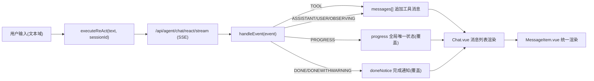

# 前端开发文档（real-agent-font）

本指南帮助你快速上手 `kit-agent/real-agent-font` 前端子项目，了解项目结构、运行方式、事件渲染规则，以及如何在现有规范下进行功能扩展。我们尽量保持“简单、清晰、可扩展”的工程风格。

适用对象：准备一起参与开源共建的前端同学。

---

## 快速开始

- 必备环境
  - Node.js 18+（推荐 20+）
  - 包管理器：npm 或 pnpm（建议统一使用 npm）
- 安装依赖
  - 在 `real-agent-font/` 下执行：
    ```bash
    npm install
    ```
- 启动开发服务器
  ```bash
  npm run dev
  ```
- 构建产物
  ```bash
  npm run build
  ```
- 本地预览构建产物
  ```bash
  npm run preview
  ```

---

## 项目结构

路径根：`kit-agent/real-agent-font/`

- `src/pages/Chat.vue`
  - 应用主页面，负责整体布局、消息列表渲染、发送输入、全局进度显示器、任务完成通知、一键下滑按钮。
- `src/components/MessageItem.vue`
  - 单条消息组件。统一渲染策略：工具消息结构化展示；普通消息通过 Markdown 渲染；用户消息右侧气泡样式。
  - 已取消“流式渲染模式”，仅保留统一的 Markdown 驱动渲染。
- `src/components/MarkdownViewer.vue`
  - 异步加载的 Markdown 渲染组件（基于 markdown-it），支持代码高亮、任务清单、数学公式等。
- `src/components/ToolApprovalCard.vue`
  - 工具审批类消息的展示组件。
- `src/components/ToolBox.vue`
  - 工具返回结果的卡片化展示能力（数组 → 卡片网格；对象/原始 → JSON/文本美化）。
- `src/composables/useSSE.ts`
  - SSE 组合式函数，负责与服务端建立事件流连接、事件解析、状态管理（messages、progress、doneNotice 等）。
- `src/styles/chat.css`
  - 页面级样式：聊天布局、全局进度显示器、任务完成通知、一键下滑按钮、输入区、通用按钮等。
- `src/styles/agents/react.css`、`src/styles/agents/coding.css`
  - 不同 Agent 主题色与局部样式（通过 `agentUI.themeClass` 切换）。
- `src/types/events.ts`、`src/constants/ui.ts`
  - 事件、消息类型定义与 UI 映射（`EventType`、`MessageType`、`MessageTypeMap`、`SenderLabel` 等）。

---

## 运行时数据模型

- UI 消息 `UIMessage`（简化说明）
  - 核心字段：`type`（MessageType）、`eventType`（EventType）、`message`（文本）、`data`（工具返回结构）、`sender`、`timestamp`、`nodeId`、`isCompletion` 等。
  - 用于驱动 `MessageItem.vue` 的具体渲染。
- SSE 事件 `SSEEvent`
  - 服务端推送的统一事件数据，关键字段：`type`（EventType）、`message`、`timestamp`、`agentId`、`nodeId`、`data` 等。
- 组合式状态 `useSSE.ts`
  - `messages: UIMessage[]`：消息列表
  - `nodeIndex: Record<string, number>`：按 `nodeId` 将“主消息”索引到 `messages`，便于把同一 node 的后续事件累计到同一条消息
  - `progress: { text; timestamp; agentId? } | null`：全局唯一进度状态（不进入 `messages`）
  - `doneNotice: { text; timestamp; title } | null`：全局任务完成通知（不进入 `messages`）
  - `executeReAct(text, sessionId)`：发起 ReAct 会话（SSE）
  - `handleEvent(event)`：SSE 事件总入口（解析与分发）

---

## 关键渲染规则

- 不再区分“流式/Markdown/时间线/JSON”等渲染模式
  - `MessageItem.vue` 统一采用 Markdown 驱动，工具消息结构化渲染。
- 工具消息（MessageType.Tool）
  - 结构化优先：数组 → 卡片网格；对象 → JSON 美化；原始 → 文本。
  - 同一 `nodeId` 的工具事件会作为“独立消息”插入，但与主消息共享归属（视觉上相邻）。
- 进度（EventType.PROGRESS）
  - 全局唯一、顶替旧进度，不落入 `messages`。
  - 展现在 `Chat.vue` 顶部的 `.global-progress`（sticky），包含旋转沙漏、进度文本、时间戳。
- 任务完成（EventType.DONE / DONEWITHWARNING）
  - 不以消息卡片呈现。
  - 统一在右上角以 `.done-notice` 浮动卡片通知，文案使用事件里的 `message`，时间戳+任务标题（用户输入，超出省略号）。
- 用户消息
  - 右侧蓝色气泡样式 `.message.user`，与 AI 助手消息进行明显区分。
- 一键下滑
  - 右下角悬浮按钮 `.scroll-bottom-btn`，手动回到底部。默认不开启自动滚动（可按需调整）。

---

## 事件流与渲染数据流



关键点：
- `PROGRESS` 与 `DONE/DONEWITHWARNING` 不再进入 `messages`，而是进入专门的全局状态。
- 其他事件按 `nodeId` 归并到主消息或以工具消息单独行呈现。

---

## 代码位置速览（常用改动点）

- 修改“全局进度/完成通知”的展示
  - `src/pages/Chat.vue`：`<div v-if="progress" class="global-progress">` 与 `<div v-if="doneNotice" class="done-notice">`
  - `src/styles/chat.css`：`.global-progress`、`.done-notice` 样式
  - `src/composables/useSSE.ts`：`progress`、`doneNotice` 的组装逻辑
- 新增/调整事件类型
  - `src/types/events.ts`：添加新的 `EventType`
  - `src/constants/ui.ts`：更新 `MessageTypeMap` 和 `SenderLabel`
  - `src/composables/useSSE.ts`：在 `handleEvent()` 添加新事件的处理分支
  - 如需渲染自定义卡片，扩展 `MessageItem.vue` 或新增组件
- 扩展工具结果渲染
  - `src/components/ToolBox.vue`：新增字段映射或卡片展示样式
  - `src/components/MessageItem.vue`：如需根据工具类型（name/id）定制特化卡片，建议在结构化渲染层加“工具类型分支”

---

## UI/主题与可视化规范

- 主题切换
  - `src/pages/Chat.vue` 计算得到 `agentUI.themeClass`，用于在根容器上挂主题类名。
  - 主题样式位于 `src/styles/agents/*.css`（如 `react.css`、`coding.css`），可以通过 `.theme-react .message.action { ... }` 覆盖默认样式。
- 消息语义类
  - `MessageItem.vue` 根节点类名 `['message', messageCssClass]`，可选值包括：`thinking / action / observing / tool / warning / error / completed / system / user`。
  - 主题扩展时优先在各主题 CSS 中覆盖这些语义类。
- 全局状态样式
  - `.global-progress` 顶部状态条（yellow 系）、沙漏旋转动画 `@keyframes spin`
  - `.done-notice` 右侧完成通知（green 系）、标题省略号样式

---

## 开发约定与最佳实践

- TypeScript + Vue 3 Composition API
  - 统一使用组合式 API，组件内部尽量使用 `setup` 写法。
- 事件处理的防御性编程
  - `handleEvent()` 中优先做 `null/undefined` 校验；容错非 JSON 的 `message`/`data`。
  - `parseToolPayload()` 已兼容常见“对象/数组/字符串包裹的 JSON”等返回。
- 渲染统一化
  - 避免引入新渲染模式分支（如 stream/json/timeline 等），在统一渲染策略下扩展组件能力。
- 性能与交互
  - 控制消息列表 DOM 层级；大文档以 Markdown 懒加载渲染。
  - 默认不自动滚动，保留手动“下滑”按钮，减少打断阅读的行为。
- UI 一致性
  - 新增组件请使用现有配色、阴影、圆角、内边距的通用视觉规范。
  - 图标采用统一 emoji/伪元素优先策略，避免引入重型 icon 库。

---

## 扩展示例

- 新增一个事件类型（例如：`VALIDATING`）
  1. 在 `src/types/events.ts` 定义 `EventType.VALIDATING`
  2. 在 `src/constants/ui.ts` 将其映射到 `MessageTypeMap`，决定它是 `Assistant` 还是其它类型消息
  3. 在 `src/composables/useSSE.ts` 的 `handleEvent()` 添加分支逻辑（写入 `messages` 还是进入某个全局状态）
  4. 在 `src/components/MessageItem.vue`（如需要）添加样式映射；在主题 CSS 中覆盖颜色
- 为某个工具结果提供专属卡片
  1. 在 `ToolBox.vue` 中根据 `toolName` 或 `data` 的标识字段走特化渲染分支
  2. 提供专属 CSS 类与 icon
  3. 仍保留“数组/对象/文本”这套通用兜底逻辑

---

## 与后端接口约定（SSE）

- SSE 端点：`POST /api/agent/chat/react/stream`
- 基本事件结构（示例）
  ```json
  {
    "type": "PROGRESS",
    "message": "思考中：构建工具参数...",
    "timestamp": "2025-09-23T14:20:30Z",
    "agentId": "ThinkingAgent",
    "nodeId": "node-123",
    "data": null
  }
  ```
- 重要语义
  - `PROGRESS`：只更新全局进度（覆盖旧值）
  - `DONE` / `DONEWITHWARNING`：只触发“任务完成通知”，不进入消息列表；`message` 作为通知主文案
  - 其他事件：按 `nodeId` 归并或追加到 `messages`，驱动消息列表渲染

---

## 常见问题（FAQ）

- 进度条为什么不在消息列表里显示？
  - 设计为“全局唯一状态显示器”，减少消息噪音；最新进度覆盖旧进度。
- 为什么 `DONE` 没有消息卡片？
  - 采用“右侧通知卡片”的方式统一呈现任务完成，文案来自 `DONE.message`，标题取用户输入（溢出省略号），更直观。
- 如何关闭“完成通知”？
  - 当前为常驻（直到开始新任务自动清理）。如果需要，让我在通知卡片上加“关闭按钮”或“自动消失”。

---

## 贡献指南（建议）

- 代码风格
  - 使用 ESLint + Prettier（若未配置，可在 PR 中补充）
  - 文件命名：`kebab-case`（组件 `.vue`）、`camelCase`（变量/方法）
- 提交规范
  - 建议使用简要前缀：`feat: `、`fix: `、`refactor: `、`docs: `、`style: `、`chore: `
- PR 说明
  - 简述变更动机、方案逻辑、影响范围、截图/GIF
  - 若涉及事件协议变更，请同步更新本文档“与后端接口约定（SSE）”与类型定义

---

## 后续路线（Roadmap）

- 完成通知的交互增强（点击定位、自动淡出/关闭）
- ToolBox 针对常用工具的特化卡片库
- 移动端适配（窄屏时的消息密度与按钮布局）
- 主题配置面板（热切换、导出主题）

---

如需将本指南调整为英文版本或拆分更细的章节（如“UI 规范”、“类型与协议”、“示例扩展”），欢迎在 Issue 中提出建议或直接发起 PR。

---

## 截图（Screenshots）

以下示例截图位于 `docs/images/` 目录（请在提交前将占位图片替换为真实截图）：

- 进度状态条（Global Progress）
  - 路径：`docs/images/progress-status.png`
- 任务完成通知（Done Notice Stack）
  - 路径：`docs/images/done-notice-stack.png`
- 用户气泡（User Bubble）
  - 路径：`docs/images/user-bubble.png`
- 工具卡片（Tool Cards）
  - 路径：`docs/images/tool-cards.png`

建议使用 2x/3x 分辨率截取，JPG/PNG 均可，文件名保持小写、中划线风格。

